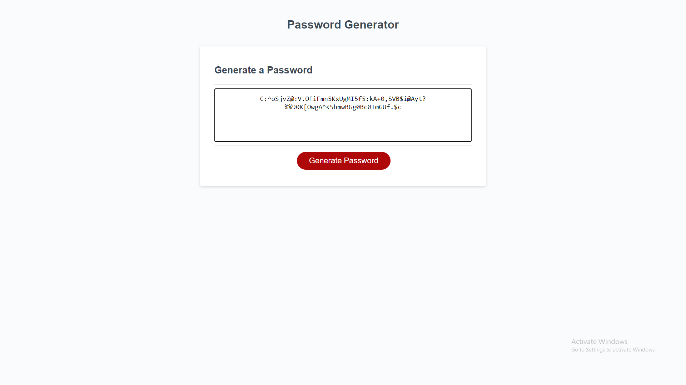

# Password-Generator

# We were given a template and asked to create a password generator for a client.

# The client wanted the password to be between 8-124 characters, while being able to use any character, number, or special character.

# We started by created variables for each letter, number, and special character. 

# Then we promted the used to create their random password.

# Last we concacted all the variables into a generated password.

# Link to the website!

https://zgibbs97.github.io/Password-Generator/.